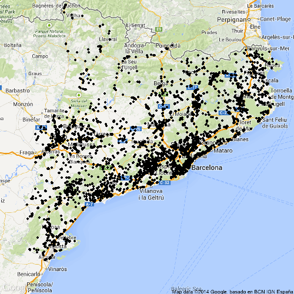
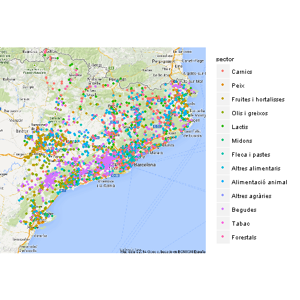
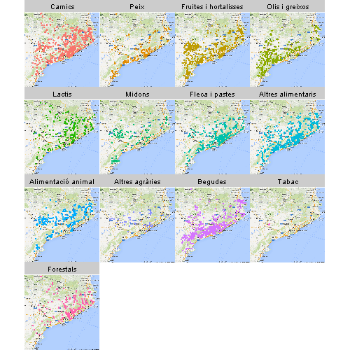

## Objectius

<br>

* Entendre estructura dades espacials
* Tractar dades espacials amb R
* Conèixer packages per representar mapes
* Crear mapes temàtics
* Crear mapes sobre Google Maps
* Crear mapes dinàmics

## Tipus objectes espacials 

<br>

* __Points__ (escoles, empreses alimentaries, ...)
* Lines (carreteres, rius, ...)
* __Polygons__ (paisos, comarques, ...)
* Grid/Raster (informació per cada cel·les) 

<br>

### Només tractarem Points i Polygons

* __Polygons__: Mapes temàtics
* __Points__: Mapes sobre Google Maps

<br>

Importarem informació Polygons d'un shapefile. <br>
Es podria crear amb R però complicat [Spatial Cheatsheet][].

[Spatial Cheatsheet]: http://www.maths.lancs.ac.uk/~rowlings/Teaching/UseR2012/cheatsheet.html

## Què és un Shapefile?

<br>

Format intercanvi informació geogràfica.

<br>

* __shp__: emmagatzema entitats geomètriques dels objectes
* __dbf__: emmagatzema informació dels atributs dels objectes
* __shx__: emmagatzema l'índex de les entitats geomètriques

<br>

Molts organismes oficials ofereixen les dades geogràfiques en aquest format.

## Importar mapa d'europa

<br>

### Llibreria __maptools__

* getinfo.shape
* readShapeXXX 

(XXX: Spatial, Points, Lines, Poly)

```{r shape europa, message = FALSE}
library(maptools)
getinfo.shape("data/europa.shp")
europa <- readShapePoly("data/europa.shp")
```

<br>

Què és europa? Un list? Un data.frame?

## Estructura dades espacials 

<br>

### Llibreria __sp__

<br>

### [Orientat a objectes][] ([S4 Classes][])

<br>
<ul>
* Objectes: Conté atributs que descriuen l'objecte
* Mètodes: Funcions sobre els objectes
* Benficis com: Inheritance, Polymorphism, Encapsulation, etc.
</ul>

[Orientat a objectes]: http://en.wikipedia.org/wiki/Object-oriented_programming
[S4 Classes]: http://stat.ethz.ch/R-manual/R-devel/library/methods/html/Classes.html

## Estructura sp

<section>

```{r estructura sp}
is(europa)
isS4(europa)
getClass("SpatialPolygonsDataFrame")
```

---

```{r}
slotNames(europa)
str(europa, max.level = 2)
bbox(europa)
```

---

```{r}
names(europa)
summary(europa)
```

</section>

## Gràfic base

<section>
```{r plot base, fig.height = 5.4}
plot(europa)
```

---

```{r, fig.height = 5.4}
plot(europa, bg = "black", col = "white")
```

---

```{r, fig.height = 5.4}
plot(europa, bg = "steelblue1", col = "wheat", border = "sienna4", lwd = 1.6)
```

</section>

## Preus europeus de l'electricitat 

<br>

Continuació entrada [Evolució del preu de l’electricitat][]

[Evolució del preu de l’electricitat]: http://rugbcn.wordpress.com/2014/02/03/evolucio-del-preu-de-lelectricitat/

```{r dades preu_elec}
load("data/preu_elec.RData")
head(preu_elec)
```

<br>

* col2013 ja té el color segons intervals
* Com crear color explicat a [Mapes amb R][]
* Llibreries [classInt][], [RColorBrewer][], funció palette, findColours

[Mapes amb R]: http://rpubs.com/Lluis_Ramon/Presentacio_mapes_amb_R
[classInt]: http://cran.r-project.org/web/packages/classInt/index.html
[RColorBrewer]: http://cran.r-project.org/web/packages/RColorBrewer/index.html

## Creuar dades europa

<section>

<br>

merge accepta un Spatial i un data.frame.

```{r merge preu_elec}
europa_elec <- merge(europa, preu_elec, by.x = "SP_ID", by.y = "geo")
is(europa_elec)
head(europa_elec@data)
```

---

<br>

col a vector of colour values

```{r mapa_elec}
plot(europa_elec, col = europa_elec$col2013)
```

</section>

## spplot

<br>

```{r spplot}
colors <- colorRampPalette(c("#669966", "#336699", "#FFFF00", "#990033"))(32)
spplot(europa_elec, zcol = c("a2010", "a2013", "a2004", "a2007"), col.regions = colors)
```

* Paleta de colors sobre tots els anys
* Utilitza package lattice. Funcionament semblant.

## Mapa de industries agraries i alimentaries de Catalunya

<br>

Dades del [Registre d'indústries agràries i alimentàries de Catalunya (RIAAC)][].

[Registre d'indústries agràries i alimentàries de Catalunya (RIAAC)]: http://www20.gencat.cat/portal/site/DAR/menuitem.ea4a9707647429b7a3bc8110d8c0e1a0/?vgnextoid=870f4881cbb24110VgnVCM1000000b0c1e0aRCRD&vgnextchannel=870f4881cbb24110VgnVCM1000000b0c1e0aRCRD&vgnextfmt=detall2&codInf=13732&action=consultar


```{r dades industries alimentaries}
load("data/ind_ali.RData")
head(ind_ali)
```

* He simplificat i reduït els camps.
* Coordenades en UTM.
* Farem un mapa amb fons de Google Maps. Requereix coordenades LonLat.

## Canviar sistema de coordenades

<br>

### Llibreria __rgdal__

Funció spTransform, CRS

<br>

```{r Canviar sistema de coordenades, message = FALSE}
library(rgdal)

coord_utm <- CRS("+proj=utm +zone=31")
coord_LonLat <- CRS("+proj=longlat")

ind_sp_utm <- SpatialPoints(ind_ali[, c("x", "y")], proj4string = coord_utm)
ind_sp_LonLat <- spTransform(ind_sp_utm, coord_LonLat)
lon <- coordinates(ind_sp_LonLat)[, 1]
lat <- coordinates(ind_sp_LonLat)[, 2]
ind_ali_LonLat <- cbind(ind_ali[, c("establiment", "sector")], lon, lat)

head(ind_ali_LonLat)

```


## RGoogleMaps

<section>

```{r mapa fons, eval = FALSE}
library(RgoogleMaps)
mapa_fons <- GetMap.bbox(ind_ali_LonLat$lon, ind_ali_LonLat$lat)
PlotOnStaticMap(mapa_fons)
```


---

```{r mapa industries, eval = FALSE}
PlotOnStaticMap(mapa_fons, ind_ali_LonLat$lat, ind_ali_LonLat$lon, pch = 19, cex = 0.7)
```


--- 

```{r mapa lactis i peix, eval = FALSE}
cond <- ind_ali_LonLat$sector == "Lactis"
ind_lac <- ind_ali_LonLat[cond, ]

cond <- ind_ali_LonLat$sector == "Peix"
ind_peix <- ind_ali_LonLat[cond, ]

PlotOnStaticMap(mapa_fons, ind_lac$lat, ind_lac$lon, pch = 19, cex = 0.7, col = "steelblue1")
PlotOnStaticMap(mapa_fons, ind_peix$lat, ind_peix$lon, pch = 19, cex = 0.7, col = "blue", add = TRUE)
```


</section>

## ggplot2 + ggmap

<section>

<br>

* Utilitza [ggplot2][] de base
* ggplot2 permet fer mapes temàtics (funció fortify i geom_map)
* ggmap té funcions interessants (geocode, mapdist, route)
* Explicat a [Introducción práctica a la librería ggplot2 y su integración con ggmap][]

[ggplot2]: http://cran.r-project.org/web/packages/ggplot2/index.html
[Introducción práctica a la librería ggplot2 y su integración con ggmap]: http://rpubs.com/Lluis_Ramon/Prestantacion_ggplot2_ggmap

---

```{r ggmap, eval = FALSE}
library(ggmap)
center = c(mean(ind_ali_LonLat$lon), mean(ind_ali_LonLat$lat))
zoom <- min(MaxZoom(range(ind_ali_LonLat$lat), range(ind_ali_LonLat$lon))) # MaxZoom es de RgoogleMaps
mapa <- get_map(location = center, zoom = zoom, maptype =  "roadmap")
ggmap(mapa, extent = "device")
```

 


---

```{r ggmap industries, eval = FALSE}
ggmap(mapa, extent = "device") + geom_point(data = ind_ali_LonLat, aes(lon, lat))
```



---

```{r ggmap colour, eval = FALSE}
ggmap(mapa, extent = "device") + 
  geom_point(data = ind_ali_LonLat, aes(lon, lat, colour = sector))
```



---

```{r ggmap facets, eval = FALSE}
ggmap(mapa, extent = "device") + 
  geom_point(data = ind_ali_LonLat, aes(lon, lat, colour = sector), size = 0.8) + 
  facet_wrap(~sector) + guides(colour = FALSE)
```



</section>

## plotGoogleMaps

```{r plotGoogleMaps, eval = FALSE}
library("plotGoogleMaps")
ind_sp <- SpatialPointsDataFrame(ind_sp_LonLat, ind_ali[, c("establiment", "sector")])
plotGoogleMaps(ind_sp[1:99, ], filename = "Mapes dinamics/plotGoogleMaps.html", mapTypeId = "ROADMAP")
```

<a href = http://lluisramon.github.io/Introduccio-mapes-amb-R/Mapes%20dinamics/plotGoogleMaps.html>

</a>


## LeafletR

```{r leafletR, eval = FALSE, message = FALSE}
library("leafletR")
leaflet <- toGeoJSON(data = ind_ali_LonLat[1:99, c("lat",  "lon", "sector")], dest = "Mapes dinamics", name = "leaflet")
ind_html <- leaflet(data = leaflet, dest = "leaflet", popup ="sector", base.map="mqsat", incl.data = TRUE)
browseURL(ind_html)

```

<a href = http://lluisramon.github.io/Introduccio-mapes-amb-R/Mapes%20dinamics/leafletMap/leafletMap.html>

</a>

## googleVis

```{r googleVis, message=FALSE, warning=FALSE, results='asis', eval = FALSE}
library(googleVis)
ind_ali_LonLat$LatLong <- paste(ind_ali_LonLat$lat, ind_ali_LonLat$lon, sep = ":")
indGoogleVis <- gvisMap(ind_ali_LonLat, "LatLong", 
                        options = list(useMapTypeControl = TRUE, 
                                       width = 800,height = 800))
# plot(indGoogleVis)
print(indGoogleVis, file = "Mapes dinamics/googleVis.html")
```


<a href = http://lluisramon.github.io/Introduccio-mapes-amb-R/Mapes%20dinamics/ggVisMap.html>
 
</a>


## Quins packages hem usat?

<br>

* [sp][] (informació espacial, mapes temàtics)
* [maptools][]  (input/output)
* [rgdal][]  (projeccions, input/output)
* [RgoogleMaps][] i [ggmap][] (Afegir fons de Google Maps)
* [plotGoogleMaps][], [leafletR][], [googleVis][] (mapes dinàmics)


[sp]: http://cran.r-project.org/web/packages/sp/index.html
[maptools]: http://cran.r-project.org/web/packages/maptools/index.html
[rgdal]: http://cran.r-project.org/web/packages/rgdal/index.html
[RgoogleMaps]: http://cran.r-project.org/web/packages/RgoogleMaps/index.html
[ggmap]: http://cran.r-project.org/web/packages/ggmap/index.html
[plotGoogleMaps]: http://cran.r-project.org/web/packages/plotGoogleMaps/index.html
[leafletR]: http://cran.r-project.org/web/packages/leafletR/index.html
[googleVis]: http://cran.r-project.org/web/packages/googleVis/index.html

## Quins packages NO hem usat?

<br>

* [maps][]
* [rworldmap][]
* [rgeos][]
* [osmar][] [Ex. osmar][]
* [geosphere][] [Ex. vols avions][]
* [rMaps][] (a github) [Ex. rMaps][]
* [etc][]

[maps]: http://cran.r-project.org/web/packages/maps/index.html
[rworldmap]: http://cran.r-project.org/web/packages/rworldmap/index.html
[rgeos]: http://cran.r-project.org/web/packages/rgeos/index.html
[osmar]: http://cran.r-project.org/web/packages/osmar/index.html
[Ex. osmar]: http://rugbcn.wordpress.com/2013/08/21/transport-public-de-zagreb/
[geosphere]: http://cran.r-project.org/web/packages/geosphere/index.html
[Ex. vols avions]: http://flowingdata.com/2011/05/11/how-to-map-connections-with-great-circles/
[rMaps]: https://github.com/ramnathv/rMaps
[Ex. rMaps]: http://rmaps.github.io/blog/posts/animated-choropleths/index.html
[etc]: http://cran.r-project.org/web/views/Spatial.html

## Referències

<br>

* Llibre [Applied Spatial Data Analysis with R][]
* [CRAN Task View: Analysis of Spatial Data][]
* R-News: [Classes and methods for spatial data in R][]
* [Spatial cheat Sheet][]
* [Mapes amb R][]
* [Introducción práctica a la librería ggplot2 y su integración con ggmap][]
* [S4 Classes in 15 pages, more or less][]


[Applied Spatial Data Analysis with R]: http://www.springer.com/public+health/book/978-0-387-78170-9
[CRAN Task View: Analysis of Spatial Data]: http://cran.r-project.org/web/views/Spatial.html
[Classes and methods for spatial data in R]: http://www.r-project.org/doc/Rnews/Rnews_2005-2.pdf
[Spatial cheat Sheet]: http://www.maths.lancs.ac.uk/~rowlings/Teaching/UseR2012/cheatsheet.html
[S4 Classes in 15 pages, more or less]: https://www.stat.auckland.ac.nz/S-Workshop/Gentleman/S4Objects.pdf


